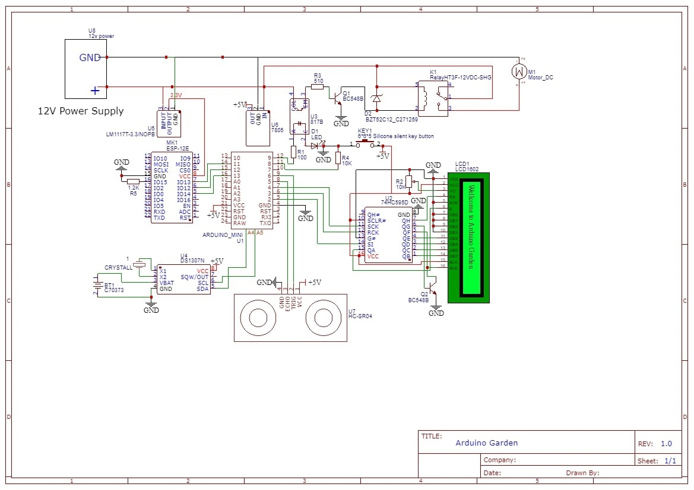

# Arduino Garden Bot
Well, this is just a DIY project started due to lazzyness for watering plant. While planning to make automated system to water plants, I came across Arduino open hardware development board which is an excellent place to start, along with esp8266 wifi module which made more room to additional functionalitues like: NTP sync with DS1307. 
This automated gardening system waters plants every alternate days (as I have set this way.)

Currently working on, which is in Progress: watering the plants only when they’re thirsty, turning on supplemental lights based on how much natural sunlight is received, and alerting me if the temperature drops below a plant-healthy level

I am open to constructive criticism, but go easy because just about everything in this project was a first for me.

For a brief introduction to this project, i am in process of creating a introduction video which will take few days to go live.

## Components
The following list covers the major parts I used in the build.
* LCD 16x2
* DS1307 RTC
* ESP8266-12e
* Arduino mini
* 12v motor pump
* 5v Relay
* 3.3 & 5 voltage regulator
* 74HC595 shift register
* optocoupler 817b
* 12v wall adapter

## Wiring Diagram
The schematic below shows the wiring of the board.

## Dependencies

package | Version
--- |:---:|
[RTClib](https://github.com/adafruit/RTClib) | 1.2.0
[NewPing](https://playground.arduino.cc/Code/NewPing) | 1.8
[LiquidCrystal595](https://bitbucket.org/rowansimms/arduino-lcd-3pin) | 
[esp8266](https://github.com/esp8266/Arduino) | 2.4.1

## Contributing

See the [CONTRIBUTING] document. Thank you, [contributors]!

## License

Arduino Garden is Copyright (c) 2018 Gaurav Singh. It is free software, and may be redistributed under the terms specified in the [LICENSE] file.

## About

Arduino Garden is maintained by [@antoniomerlin](https://github.com/antoniomerlin)

## Author

Gaurav Singh <gauravsinghbr@hotmail.com>

## License
Apache-2.0

[LICENSE]: /LICENSE
[CONTRIBUTING]: CONTRIBUTING.md
[contributors]: https://github.com/antoniomerlin/Arduino_Garden/graphs/contributors